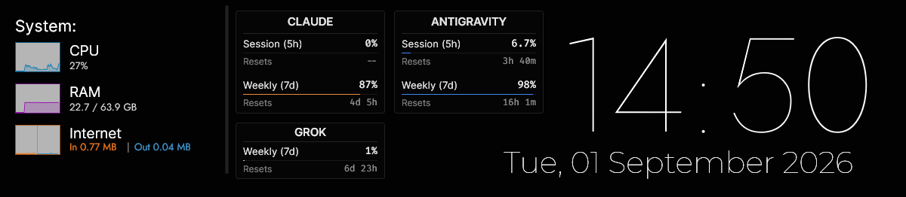

# Before Dawn RM Bar — with AI usage panels

A single-skin desktop bar that carries the **Claude**, **Antigravity** and **Grok** usage
panels inline, instead of running them as three floating widgets.

[](LICENSE)



Fixed 1200×262. System graphs on the left, the three usage panels in the middle, clock and
date on the right. One Lua script (`@Resources/aiusage.lua`) drives all three panels: it
reads the snapshots, recomputes every reset countdown locally each second, and schedules
each service's fetcher on its own timer — **Claude every 2 min**, **Antigravity every 5 min**,
**Grok every 5 min**.

> **This branch has its own history.** It is not a change to `main` — `main` ships the
> three standalone widgets, this ships the bar that consumes them. There is no common
> ancestor and diffing the two branches is meaningless.

## Requires the widgets from `main`

The bar does **not** contain the fetchers. It points at them:

```ini
AIRoot=#SKINSPATH#AIUsageLimits\@Resources\
```

So install [AI Usage Limits](https://github.com/Sto3IV/claude-usage-rainmeter) first — the
`.rmskin` from the latest release, or the `Skins/AIUsageLimits/` tree from `main` copied
into your skins folder. One copy of each fetcher, one snapshot per service, no duplication.
Rename or move that folder and all three panels go to `no data`.

**Keep the three `AIUsageLimits\*` configs unloaded (`Active=0`).** The bar runs their
fetchers itself; loading the standalone skins as well polls every endpoint twice, and
Claude's answers that with `429`.

## Requirements

- Windows 10 or later
- [Rainmeter 4.5+](https://www.rainmeter.net/)
- [AI Usage Limits](https://github.com/Sto3IV/claude-usage-rainmeter) installed (above),
  which brings its own Python requirement
- Fonts, installed system-wide: [Inter](https://fonts.google.com/specimen/Inter),
  [Jost](https://fonts.google.com/specimen/Jost),
  [Montserrat](https://fonts.google.com/specimen/Montserrat),
  [Fira Code](https://fonts.google.com/specimen/Fira+Code)

Missing fonts do not break the skin — Rainmeter silently substitutes, and the layout drifts.
Fira Code carries the numbers specifically because it is monospaced, so the percent and
countdown columns line up across all three panels without hand-padding.

## Install

1. Copy `Skins/Before Dawn RM Bar/` into your Rainmeter skins folder
   (usually `Documents\Rainmeter\Skins\`).
2. Refresh Rainmeter, then load **Before Dawn RM Bar → bar.ini**.
3. Drag it where you want it. The bar is a fixed 1200×262 — it does not track
   `#WORKAREAWIDTH#`.

## What the panels show

| Panel | Rows | Data refresh |
| --- | --- | --- |
| **Claude** | Session (5h) + Weekly (7d) | every **2 min** |
| **Antigravity** | Session (5h) + Weekly (7d) | every **5 min** |
| **Grok** | Weekly (7d) | every **5 min** |

Countdowns tick every second regardless of fetch cadence — they are recomputed from the
stored reset timestamp, not from what the fetcher last rendered.

A failed refresh never blanks a panel. The last good reading stays. The header shows a
short status (`timeout`, `limited`, `expired`) when the live fetch failed and that reading
is still on screen, then a muted age suffix (`1h old`, `2d old`) once it is genuinely stale.
A hard miss with nothing to fall back on uses the same seven-character statuses
(`no auth`, `offline`, `corrupt`). Statuses are capped at seven characters — the header
row is shared with a centred title and `ANTIGRAVITY` is wide enough that anything longer
collides with it.

The panels carry no mouse actions, so there is no click-to-refresh — updates are automatic.
To force one, run the service's `fetch.cmd` by hand; `aiusage.lua` re-reads the snapshots on
a 5 s timer and will pick it up.

## Customising

Everything positional lives in `[Variables]` at the top of `bar.ini`.

| Variable | Meaning |
| --- | --- |
| `BarWidth` / `BarHeight` | Overall size, 1200×262 |
| `BgColor` / `BgMainAlpha` | Substrate, dark at 38/255 |
| `SysX`, `SysRow1Y`, `SysRowH` | Left system block |
| `AIX`, `AIWideW`, `AITopY`, `AITopH`, `AIGrokY`, `AIGrokH` | The three panels |
| `ClockX`, `ClockY`, `ClockSize`, `DateY` | Right column, nudged independently of content |
| `AIPanelBg`, `AIPanelEdge`, `AI*Accent` | Panel fill, hairline border, per-service bar colour |

Two things worth knowing before you move anything:

- **Everything bottoms out on `y=237`**, the date's last ink row, leaving 24 px of bottom
  margin. The Grok panel's `H=74` (not 73) is deliberate: the 1 px stroke is centred on the
  path, so `163.5 + 74` puts the painted border exactly on that row.
- **`ClipString=1` clips to the meter's `W`×`H`**, and `H` has to cover the whole GDI+ line
  box, not the cap height. For Inter that is `ceil(1.21 × FontSize × 96/72)` — 17 px at
  size 10. Too small and the descenders of `y` and the parentheses in `Weekly (7d)` simply
  do not render.

Fetch cadence and the staleness thresholds are constants at the top of
`@Resources/aiusage.lua`.

## Credits

The substrate and the original bar concept come from **Before Dawn** by
[lianx-design](https://www.deviantart.com/lianx-design) on DeviantArt; the system graph
treatment follows **TMexe**. This repository holds the customised layout and the
`aiusage.lua` panel logic, not the original artwork — please credit the original authors if
you build on this further.

## License

MIT, for the code in this repository. See [LICENSE](LICENSE).
