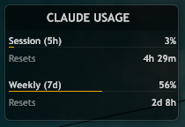
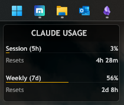
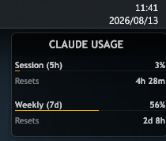

# AI Usage Limits

Small [illustro](https://docs.rainmeter.net/manual/installing-skins/)-style Rainmeter skins for your AI coding plan limits — **Claude Code**, **Grok** and **Antigravity**, in one package.

[](https://github.com/Sto3IV/claude-usage-rainmeter/releases/latest)
[](LICENSE)

Each skin shows how much of your window you have used, plus a countdown to the next reset that ticks every second.

| Skin | Shows | Source |
| --- | --- | --- |
| **Claude** | Session (5h) + Weekly (7d) used | `api.anthropic.com/api/oauth/usage` |
| **Grok** | Weekly SuperGrok used | Grok CLI billing endpoint, falling back to its local log |
| **Antigravity** | Session (5h) + Weekly (7d) Gemini quota | the local Antigravity language server |

Load whichever ones you use — they are independent and each can be positioned separately.

## Screenshots



Size next to the Start button and a typical clock widget:

<p>


</p>

## Features

- Used-percent bars for each window the provider reports
- Reset countdown recomputed locally every second, independent of how often data is fetched
- Click the title (or right-click → **Refresh now**) for an immediate update
- **A failed refresh never blanks the panel** — the last good reading stays on screen, and the skin only says so once that reading is genuinely stale
- Automatic backoff when a provider rate-limits, so the skin backs away instead of hammering
- Errors are explicit ("Credentials expired", "Rate limited") and never faked as 0 %
- Same look as the built-in illustro skins

## Requirements

- Windows 10 or later
- [Rainmeter 4.5+](https://www.rainmeter.net/)
- [Python 3.10+](https://www.python.org/downloads/) with the **py launcher** enabled (default)
- Whichever tools you want to track, installed and logged in:
  [Claude Code](https://docs.anthropic.com/en/docs/claude-code) (`claude`), Grok CLI (`grok login`), Antigravity

## Getting started

### Automatic install

1. Download the latest `.rmskin` from [Releases](https://github.com/Sto3IV/claude-usage-rainmeter/releases/latest).
2. Double-click it and go through the Rainmeter installer.
3. `AIUsageLimits\Claude\Claude.ini` loads by default. Add **Grok** and **Antigravity** from Manage if you want them.

### Manual install

1. Copy `Skins\AIUsageLimits` into `Documents\Rainmeter\Skins\`.
2. Right-click the Rainmeter tray icon → **Refresh all**.
3. Load the skins you want from Manage.

> Upgrading from 1.x? The config was renamed `ClaudeUsage` → `AIUsageLimits`, so the new package installs alongside the old one. Delete the old `ClaudeUsage` folder once you are happy.

## How authentication works

Each skin reuses the local login of the tool it tracks — no separate credentials, nothing to paste in:

| Skin | Reads |
| --- | --- |
| Claude | `CLAUDE_CODE_OAUTH_TOKEN`, else `%USERPROFILE%\.claude\.credentials.json` |
| Grok | `GROK_AUTH` / `XAI_API_KEY`, else `%USERPROFILE%\.grok\auth.json` |
| Antigravity | the running language server's own local session |

Tokens stay where the tool put them. They are not in the `.rmskin` and not in this repo — there is a test that fails the build if any credential pattern or local account path shows up in a shipped file.

If you are not logged in, or a token has expired, the skin says so instead of showing a fake 0 %.

## Polling and rate limits

The Claude usage endpoint is shared with Claude Code itself and it is stricter than it looks: at one request per minute, **three of four are rejected with HTTP 429**, and the 429 answers `Retry-After: 0`, so it offers no usable hint about when to retry.

So the skins:

- fetch Claude every **2 minutes**. Grok and Antigravity stay on **5 minutes**. Grok used to poll every 60 s while it scraped a local log; it now hits the same live billing route the CLI uses, so it keeps the 5-minute cadence. A failed HTTP call may fall back to that log, but it cannot replace a newer snapshot with an older line.
- double the interval on a 429, up to 30 minutes, and snap back on the first success
- keep showing the last good reading throughout, because the countdown is computed locally and does not need a fresh fetch to stay correct

If you shorten Claude below 2 minutes, expect 429s.

## Building

```bat
git clone https://github.com/Sto3IV/claude-usage-rainmeter.git
cd claude-usage-rainmeter
py -3 -m unittest discover -s Skins\AIUsageLimits\Claude\tests -t Skins\AIUsageLimits\Claude\tests
py -3 -m unittest discover -s Skins\AIUsageLimits\Grok\tests -t Skins\AIUsageLimits\Grok\tests
py -3 -m unittest discover -s Skins\AIUsageLimits\Antigravity\tests -t Skins\AIUsageLimits\Antigravity\tests
py -3 scripts\package.py
```

`scripts\package.py` reads the version from `RMSKIN.ini` and excludes `tests`, `__pycache__` and generated `snapshot.json` files from the package.

## Special thanks

- For inspiration: [bozdemir/claude-usage-widget](https://github.com/bozdemir/claude-usage-widget)
- Panel artwork: **illustro** by poiru ([CC BY-NC-SA 3.0](https://creativecommons.org/licenses/by-nc-sa/3.0/))
